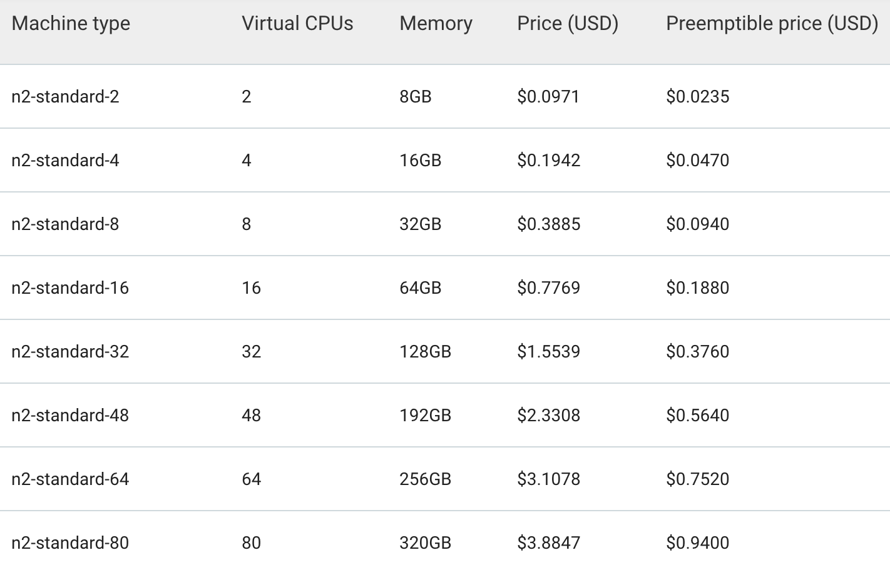
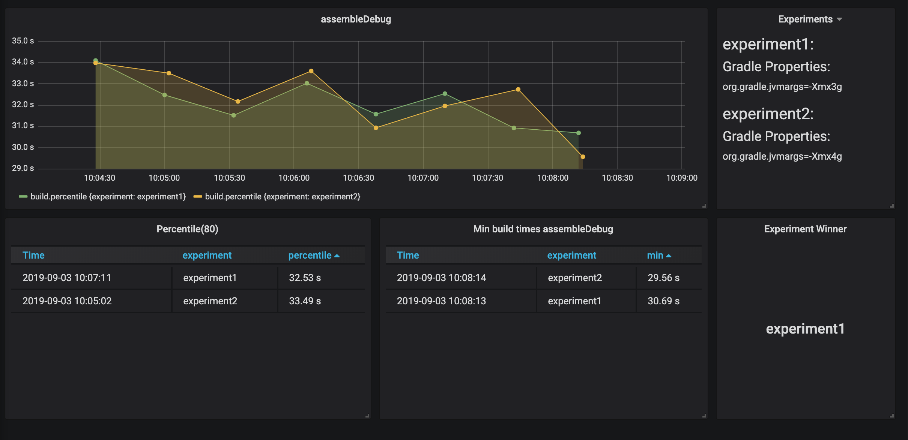
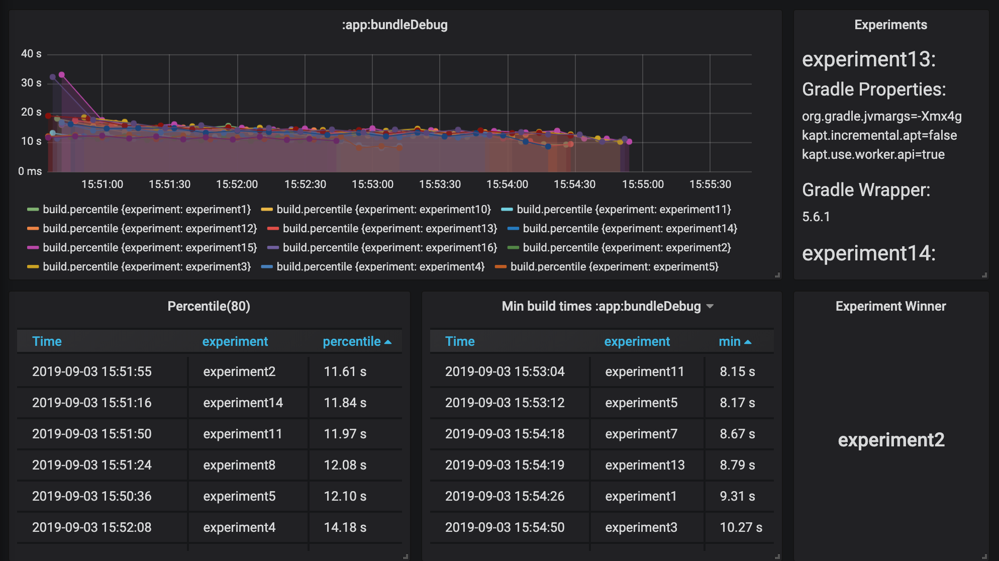

# Bagan


Bagan is a framework that helps to automate the execution, reporting and collection of data with different types of experiments in Gradle projects using Kubernetes.


# Table of Contents
1. [How to use Bagan](#how-to-use-bagan)
2. [bagan_conf.json](#bagan_conf.json)
3. [Experiments](#experiments)
4. [Modes](#modes)
5. [Commands](#commands)
6. [Requeriments Execution](#requeriments)
7. [Lifecycle Bagan](#lifecycle)
8. [Internals Bagan](#internals)
9. [The cost of Bagan](#cost)
10. [Examples](#examples)
11. [Deploying Bagan](#deploy)
12. [Constribute](#contribute)


## How to use Bagan <a name="how-to-use-bagan"></a>
Once you have downloaded this repository you need to set up the `bagan_conf.json`.  You can define different properties
like the type of experiments you want to apply, the target repository or the resources you want to use in the Kubernetes environments.

Bagan will be executed with the `./bagan` command following the next format:

` ./bagan MODE COMMAND`

The execution framework and reporting happen in Kubernetes environment. For each experiment, Bagan will create a Helm Release where it will run the target repository applying the experimentation.
To report the information of the build Bagan will inject Talaiot in the Gradle configuration of the project using InfluxDb as time-series database and Grafana as a dashboard visualization tool.

Bagan can deploy a new cluster or will use an existing cluster to execute the experimentation defined
in the main conf file.


## bagan_conf.json <a name="bagan_conf.json"></a>

| Property          |      Description                                                          |
|-------------------|---------------------------------------------------------------------------|
| repository        | Repository of the project we want to experiment                           |
| gradleCommand     | Gradle command to be executed in each Experiment from the repository                          |
| clusterName       | Name of the cluster which the experimentation will be executed. If it is not specified and the command implies the creation the default name is Bagan, modes gcloud, gcloud_docker |
| machine           | Type of Machine used bu the experimentation in modes gcloud, gcloud_docker. Check [The cost of Bagan](#cost) |
| private           | Flag to indicate the experimentation will be executed in a private repository |
| ssh               | Pah to the rsa id key for the private repository   |
| known_hosts       | Path to the known_hosts file required to create the secret on the pods   |
| iterations        | Number of executions of the Gradle command  |
| experiments       | Experimentation properties for the execution, see next section.   |

Example:
```
{
   "bagan": {
      "repository": "git@github.com:cdsap/TestPrivateRepository.git",
      "gradleCommand": "./gradlew clean assembleDebug",
      "clusterName": "",
      "machine": "n1-standard-4",
      "private": true,
      "ssh": "/user/.ssh/id_rsa",
      "known_hosts": "/user/.ssh/known_hosts",
      "iterations": 20,
      "experiments": {
         "properties": [
            {
               "name": "org.gradle.jvmargs",
               "options": ["-Xmx3g","-Xmx4g"]
            }
         ],
         "branch": [ "develop3","master"]
      }
   }
}

```

## Experiments  <a name="experiments"></a>

Experiments are the type of different entities will be applied in each experiment. You need to use at least one of the experiments to execute Bagan. Currently, the types of experiments supported are:

| Experiment             |      Description                                                          |
|------------------------|---------------------------------------------------------------------------|
| properties             | create_cluster + credentials + helm + infra_pods + experiments                                           |
| branch                 | Create infrastructure and execute experiments in the environment mode selected                          |
| gradleWrapperVersion   | Execute experiments in the environment mode selected   |

Example Pe
```
"experiments": {
   "properties": [],
   "branch": [],
   "gradleWrapperVersion": []
}
```

Bagan will apply a cartesian product for all type experiments, and each combination will be considered as an element to be tested.
In case we want to experiment with `jvmargs` in the project with will include.
```
"experiments": {
   "properties": [
      {
         "name": "org.gradle.jvmargs",
         "options": ["-Xmx3g","-Xmx4g"]
      }
   ]
}
```

|Experiments                 |
|----------------------------|
|org.gradle.jvmargs="-Xmx3g" |
|org.gradle.jvmargs="-Xmx4g" |


We can experiment with different Gradle properties at the same time and with the other type of experiments like 

```
"experiments": {
   "properties": [
      {
         "name": "org.gradle.jvmargs",
         "options": ["-Xmx3g","-Xmx4g"]
      },
      {
         "name": "org.gradle.caching",
         "options": ["true","false"]
      },
   ],
   "branch": [ "develop","master"],
   "gradleWrapperVersion" : ["5.5", 5.4"]
}
```


|Experiments                         |    | | |
|----------------------------|-------|---|------------------|
| org.gradle.jvmargs="-Xmx3g"  <br> org.gradle.caching="true" <br> develop <br> 5.5 | org.gradle.jvmargs="-Xmx3g"  <br> org.gradle.caching="true" <br> develop <br> 5.4 | org.gradle.jvmargs="-Xmx3g"  <br> org.gradle.caching="true" <br> master <br> 5.4 | org.gradle.jvmargs="-Xmx3g"  <br> org.gradle.caching="true" <br> master <br> 5.5 |
| org.gradle.jvmargs="-Xmx4g"  <br> org.gradle.caching="true" <br> develop <br> 5.5 | org.gradle.jvmargs="-Xmx4g"  <br> org.gradle.caching="true" <br> develop <br> 5.4 | org.gradle.jvmargs="-Xmx4g"  <br> org.gradle.caching="true" <br> master <br> 5.4 | org.gradle.jvmargs="-Xmx4g"  <br> org.gradle.caching="true" <br> master <br> 5.5 |
| org.gradle.jvmargs="-Xmx3g"  <br> org.gradle.caching="false" <br> develop <br> 5.5 | org.gradle.jvmargs="-Xmx3g"  <br> org.gradle.caching="false" <br> develop <br> 5.4 | org.gradle.jvmargs="-Xmx3g"  <br> org.gradle.caching="false" <br> master <br> 5.4 | org.gradle.jvmargs="-Xmx3g"  <br> org.gradle.caching="false" <br> master <br> 5.5 |
| org.gradle.jvmargs="-Xmx4g"  <br> org.gradle.caching="false" <br> develop <br> 5.5 | org.gradle.jvmargs="-Xmx4g"  <br> org.gradle.caching="false" <br> develop <br> 5.4 | org.gradle.jvmargs="-Xmx4g"  <br> org.gradle.caching="false" <br> master <br> 5.4 | org.gradle.jvmargs="-Xmx4g"  <br> org.gradle.caching="false" <br> master <br> 5.5 |

In this example, there are 16 different combinations. Bagan will create 16 different pods with the specific configuration. Check the cost of Bagan section 
to understand better the impact in terms of cost of high permutations experiments.


### Modes  <a name="modes"></a>
A `mode` is the Kubernetes   environment where you want to execute the experimentation. Modes are needed to provision and interact with the
Kubernetes environment
There are supported three modes

| Mode           |      Description                                                          |
|----------------|---------------------------------------------------------------------------|
| gcloud         | Bagan will be executed in Kubernetes Engine in Gcloud using gcloud sdk     |
| gcloud_docker  | Bagan will be executed in Kubernetes Engine in Gcloud using Docker and avoiding to set up different configurations in your machine. The image is cdsap/bagan-init |
| standalone     | Bagan will be executed in the environment configured in the host machine.   |

If you have your cluster created in Gcloud or you have a host machine where you want
to execute Bagan
Gcloud_docker will be used to encapsulate the execution of the gcloud encapsulated in a docker image

### Commands  <a name="commands"></a>
Commands are the tasks to be executed in the mode selected. There are two main commands groups.

#### Meta Commands
Used to execute a sequence of commands, these commands execute all the required steps to finish with
the experimentation on Kubernetes

| Mode           |      Description                                                          |
|----------------|---------------------------------------------------------------------------|
| cluster        | Create cluster, infrastructure and execute experiments in the environment mode selected.                                            |
| infrastructure | Create infrastructure and execute experiments in the environment mode selected                          |
| experiment     | Execute experiments in the environment mode selected   |

Examples:
```
  ./bagan gcloud cluster
  ./bagan gcloud_docker infrastructure
  ./bagan standalone experiments
```
#### Single commands
Meta commands are composed by single commands. You can execute single commands depending on your requirements.
For example, if you are using an existing cluster and some of the components required by Bagan are installed, you can execute a single command:

| Command                     |      Description                                                                                       |
|-----------------------------|--------------------------------------------------------------------------------------------------------|
| create_cluster              | Createcluster, infrastructure and execute experiments in the environment mode selected.               |
| infra_pods                  | Create infrastructure and execute experiments in the environment mode selected   (Grafana + InfluxDb)  |
| credentials                 | Get the credentials for the current cluster                                                            |
| secret                      | Create secret object in the mode selected require to experiment with private repositories              |
| helm                        | Execute initialization of helm and the cluster role binding required in Kubernetes                     |
| helm_init                   | Execute initialization of Helm                                                                         |
| helm_clusterrolebinding     | Create the cluster role binding required in Kubernetes                                                |
| grafana                     | Install the Chart of Grafana with Helm at the cluster                                                  |
| influxfb                    | Install the Chart of InfluxDb with Helm at the cluster                                                 |
| services                    | Creates a service port type Load Balance                                                               |
| remove_experiments          | Remove experiments in the cluster                                                                      |
| grafana_dashboard           | Retrieve the public IP of the Dashboard created                                                       |


So on the same way, we can see how the Meta Commands are composed:

| Command           |      Single Commands                                                          |
|-------------------|---------------------------------------------------------------------------|
| cluster           | create_cluster + credentials + helm + infra_pods + experiments                                           |
| infrastructure     | Create infrastructure and execute experiments in the environment mode selected                          |
| experiment        | credentials + experiments   |


    
## Lifecycle Bagan  <a name="lifecycle"></a>
We can group the execution of Bagan in three main stages:

* Verificiation
* Provisioning
* Execution Experiments:


### Verification 
During this phase, Bagan will validate the configuration file `bagan_conf.json` and the inputs included. It's executed in the host machine 
and requires [jq](https://stedolan.github.io/jq/) to perform the validation.  

### Provisioning 
In this phase, Bagan will execute the command included in the mode selected. 
For `gcloud` and `standalone`, modes it will be executed in the host machine. For `gcloud_docker` will be executed in a docker image(cdsap/bagan-init).
Kubectl and Helm will be configured.
Depending on the command selected, different actions will be handle. Check commands section.


### Execution 
The execution phase will be driven by the kscript `BaganGenerator.kt`. This script  has two main functions:
* Calculate the combination of experiments
* Generate the Grafana Dashboard with the experimentation and Gradle Commands
* Create and install the experiment environment.

For each experiment `BaganGenerator.kt` will create: 
* Chart.yaml
* Values.yaml
* templates/configmapexpermientN.yaml
* templates/podexperimentN.yaml

Finally, with Helm will install the package in the selected environment.

Once the experiments are running, you can check the Grafana dashboard to visualize the results:
```
http://IP:3000/d/IS3q0sSWz
```

The `IP` corresponds with the public IP exposed as Service type load balancer on the Grafana deployment. 
To check the IP you can execute :
```
./bagan gcloud grafana_dashboard
```


## Internals Bagan  <a name="internals"></a>

### Kubernetes Infrastructure

The overall picture of Bagan from the perspective of Kubernetes will be:


Once the experiments are generated and installed one Pod will be linked with the configuration, it will perform the build with the `gradleCommand` and `iterations` defined in 
the `bagan_conf.json`.  


### Pod execution 
Every experiment creates a Helm release composed of different objects like configmaps and pods. 
The execution of the build happens inside the Pod. The Docker image used by the pod is cdsap/bagan-pod. This image is responsible for:
* Fetch Target repository in a specific volume.
* Inject Talaiot in the project 
* Apply the experimentation for Gradle Properties and Gradle Wrapper versions 
* Execute the build given N iteration

The execution flow is:


### Gcloud console 


## The cost of Bagan  <a name="cost"></a>
In case you are using Google Cloud as Kubernetes environment you should consider the impact in terms of money of the selection 
of the different elements.
Resources are limited and  constraint by the type of the machine you have selected. Android projects are expensive in terms of 
memory consumption and create multiples combinations will cause the failure of the experiments:


On the other side if you consider to increase the resources of the machine we should consider the cost. Google Cloud publish the 
cost for the different types of machines:



Bagan doesn't put any restriction on the machine selected, but you should consider the impact of the experimentation. 
Once the experiments are succeeded, and you don't want to repeat experiments and the data is done you should remove the cluster in 
case you are using personal project.

Another point to consider is depending on the machine you have selected, maybe is not available in the zone you have selected. 
The default zone is `us-west1-a`, but you can choose others depending on your requirements. 
Check more documentation about region, zones and availability in Gcloud here:
https://cloud.google.com/compute/docs/regions-zones/#available


<b>In case you are using Google Cloud only to create the cluster for Bagan, we recommend to remove it after the experimentation and evaluation of the results have finished.</b>

## Examples  <a name="examples"></a>

### Example 1

Simple example of private repository generated by Android Studio

| bagan_conf      |                                                              |
|-----------------|--------------------------------------------------------------|
| machine         |n2-standard-2                                                 |
| zone            |asia-southeast1-b                                             |
| repository      |git@github.com:cdsap/TestPrivateRepository.git                |
| private         |true                                                          |
| experiments     |gradle properties :{ "org.gradle.jvmargs": ["-Xmx3g","-Xmx4g"]}|
| command         | ./gradlew clean assembleDebug                                |
| iterations      |20                                                            |

Twp experiments of Type Gradle Properties will be generated: 
* -Xmx3g
* -Xmx4g

Result:




### Example 2

Experimentation on Google project Plaid, with kapt properties

| bagan_conf      |                                                              |
|-----------------|--------------------------------------------------------------|
| machine         |n2-standard-8                                           |
| zone            |asia-southeast1-b                                             |
| repository      |https://github.com/android/plaid.git             |
| private         |false                                                          |
| experiments     |gradle properties:<br>{ "org.gradle.jvmargs": ["-Xmx2g","-Xmx4g"] }<br>{ "org.gradle.caching": ["true","false"] }<br>{ "kapt.incremental.apt": ["true","false"] }<br>{ "kapt.use.worker.api": ["true","false"] }<br>|
| command         | ./gradlew clean assembleDebug                                |
| iterations      |20                                                            |

 "properties": [
            {
               "name": "org.gradle.jvmargs",
               "options": ["-Xmx2g","-Xmx4g"]
            },
            {
               "name": "org.gradle.caching",
               "options": ["true","false"]
            },
            {
               "name": "kapt.incremental.apt",
               "options": ["true","false"]
            },
            {
               "name": "kapt.use.worker.api",
               "options": ["true","false"]
            }

16 experiments of Type Gradle Properties will be generated: 

|Experiments          |                                     | ||
|----------------------|-------------------------------------------|----|--------------------------------|
| org.gradle.jvmargs="-Xmx2g"<br>org.gradle.caching="true"<br>  kapt.incremental.apt="true" <br>kapt.use.worker.api="true" | org.gradle.jvmargs="-Xmx2g"<br> org.gradle.caching="true"<br>  kapt.incremental.apt="true" <br>kapt.use.worker.api="false" | org.gradle.jvmargs="-Xmx2g"<br> org.gradle.caching="true"<br>  kapt.incremental.apt="false" <br>kapt.use.worker.api="false" | org.gradle.jvmargs="-Xmx2g"<br> org.gradle.caching="true"<br>  kapt.incremental.apt="false" <br>kapt.use.worker.api="true" |
| org.gradle.jvmargs="-Xmx2g"<br>org.gradle.caching="false"<br>  kapt.incremental.apt="true" <br>kapt.use.worker.api="true" | org.gradle.jvmargs="-Xmx2g"<br> org.gradle.caching="false"<br>  kapt.incremental.apt="true" <br>kapt.use.worker.api="false" | org.gradle.jvmargs="-Xmx2g"<br> org.gradle.caching="false"<br>  kapt.incremental.apt="false" <br>kapt.use.worker.api="true" | org.gradle.jvmargs="-Xmx2g"<br> org.gradle.caching="false"<br>  kapt.incremental.apt="false" <br>kapt.use.worker.api="false" |
| org.gradle.jvmargs="-Xmx4g"<br>org.gradle.caching="true"<br>  kapt.incremental.apt="true" <br>kapt.use.worker.api="true" | org.gradle.jvmargs="-Xmx4g"<br> org.gradle.caching="true"<br>  kapt.incremental.apt="true" <br>kapt.use.worker.api="false" | org.gradle.jvmargs="-Xmx4g"<br> org.gradle.caching="true"<br>  kapt.incremental.apt="false" <br>kapt.use.worker.api="false" | org.gradle.jvmargs="-Xmx4g"<br> org.gradle.caching="true"<br>  kapt.incremental.apt="false" <br>kapt.use.worker.api="true" |
| org.gradle.jvmargs="-Xmx4g"<br>org.gradle.caching="false"<br>  kapt.incremental.apt="true" <br>kapt.use.worker.api="true" | org.gradle.jvmargs="-Xmx4g"<br> org.gradle.caching="false"<br>  kapt.incremental.apt="true" <br>kapt.use.worker.api="false" | org.gradle.jvmargs="-Xmx4g"<br> org.gradle.caching="false"<br>  kapt.incremental.apt="false" <br>kapt.use.worker.api="true" | org.gradle.jvmargs="-Xmx4g"<br> org.gradle.caching="false"<br>  kapt.incremental.apt="false" <br>kapt.use.worker.api="false" |


Result:


We don't appreciate on Plaid project significant different using properties like `kapt.incremental.apt` and `kapt.use.worker.api`. However, you can notice the benefits of using caching on the Gradle Builds.

### Example 3

Experimentation on Android Showcase project, with Gradle properties and different Gradle Wrapper versions

| bagan_conf      |                                                              |
|-----------------|--------------------------------------------------------------|
| machine         |n2-standard-8                                           |
| zone            |asia-southeast1-b                                             |
| repository      |https://github.com/igorwojda/android-showcase             |
| private         |false                                                          |
| experiments     |gradle properties:<br>{ "org.gradle.jvmargs": ["-Xmx2g","-Xmx4g"] }<br>{ "org.gradle.caching": ["true","false"] }<br>{ "kapt.incremental.apt": ["true","false"] }<br>{ "kapt.use.worker.api": ["true","false"] }<br>Gradle Wrapper versions: ["5.6.1","5.5"]|
| command         | ./gradlew clean :app:bundleDebug                               |
| iterations      |20                                                            |

Result:



Best times are using Gradle `5.6.1`. 

## Deploy  <a name="deploy"></a>
Bagan is open source and you can update create your requirements. 
This is the structure of the project:

| Folder               |                                                                |
|----------------------|---------------------------------------------------------------------------|
| baganGenerator       | Kotlin project with the managment of Create infrastructure and execute experiments in the environment mode selected                          |
| deploy               | Deployment script of docker images adding the build output generated by the Bagan Generator                                        |
| docker               | Docker images for the installation with docker  and execution of the Pods                      |
| k8s                  | Packages Charts for Grafana and InfluxDb  |
| scripts               |  Bash scripts for validation and provisioning of the environment  |

### Bagan Generator
Is the Kotlin project 

Additionally, it creates a custom task to override the headers and required to execute kscript on it. 

### Deploy 
If you want to use your own images, you can set-up in the deployment script the required files. 

* Build the Bagan Generator
* Copy the binaries required for each image to the folder
* Build and push the docker image for bagan-init
* Build and push the docker image for bagan-pod 

### Docker 
Contains the Docker iamges for bagan-init and bagan-pod. It includes the binaries generated by the baganGenerator in the 
deployment step.
In case you want to provide your own images you can set the values on the deployment file:

```
VERSION="0.1.6"
REGISTRY=""
IMAGE_BAGAN_INIT="cdsap/bagan-init"
IMAGE_BAGAN_POD="cdsap/bagan-pod-injector"
```

### K8s
Contains the Grafana and InfluxDb charts.
Grafana contains the provisioned data source configuration for InfluxDb. Also includes the default dashboard that will be updated when experimenteation will be execited

### Scripts
It contains the bash scripts related to the verificaction and provisioning phase. 
For each mode, there is available one command executor where the scripts can be done. 

## Contribute

## License

