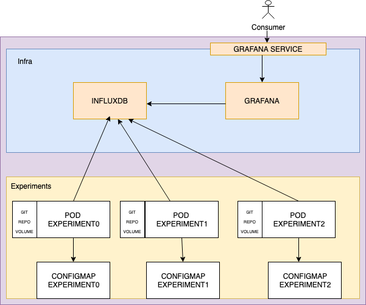
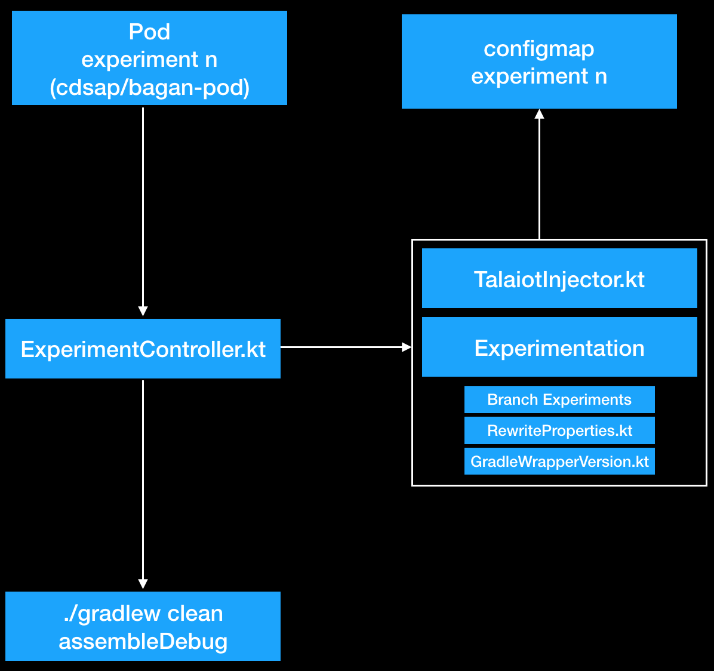
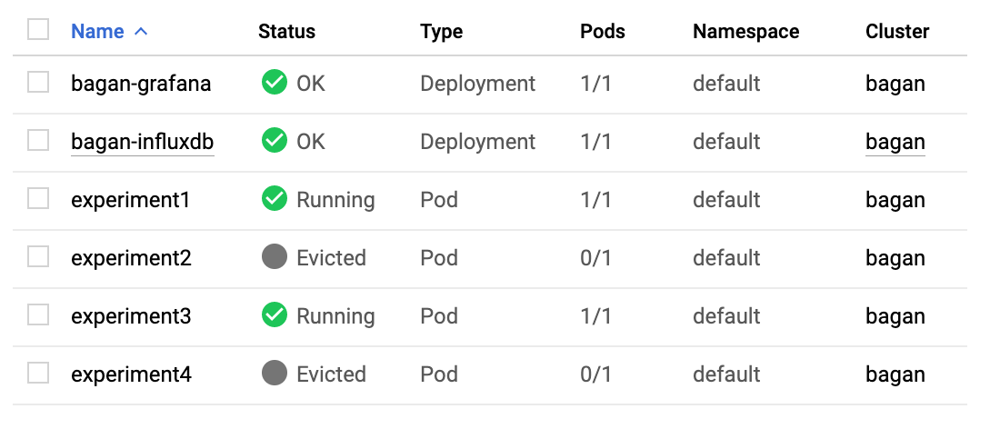

# Bagan


Bagan is a framework that helps to automate and paralelize the execution, reporting and collection of data with different types of experiments in Gradle projects using Kubernetes.

# Table of Contents
1. [How to use Bagan](#how-to-use-bagan)
2. [bagan_conf.json](#bagan_conf.json)
3. [Experiments](#example2)
4. [Modes](#example2)
5. [Commands](#example2)
6. [Requeriments Execution](#example2)
7. [Lifecycle Bagan](#example2)
8. [Internals Bagan](#example2)
9. [The cost of Bagan](#example2)
10. [Examples](#example2)
11. [Deploying Bagan](#third-example)


## How to use Bagan <a name="how-to-use-bagan"></a>
Once you have downloaded this repository you will need to set up the `bagan_conf.json`. There ypu can setup different properties
like the type of experiments you want to apply, the target repository or the resources you want to use in the Kubernetes environments.

Bagan will be executed with the `./bagan` command following the next format:

` ./bagan MODE COMMAND`

Bagan will execute the experiments in a Kubernetes environments. For each experiment Bgan will create a Pod where it will run the target repository applying the experimentation.

There using the package Manager will be created the infrastrucure applications
like Grafaa and InfluxDb and the experimentation. To report the data Bagan will use Talaiot. Bagan is working


Bagan will deploy a new cluster or will use an existing cluster to execute the experimentationw defined
in the main conf file.
Bagan will use Grafana and

## bagan_conf.json <a name="bagan_conf.json"></a>

| Property          |      Description                                                          |
|-------------------|---------------------------------------------------------------------------|
| repository        | Repository of the project we want to experiment                           |
| gradleCommand     | Gradle command to be executed in each Experiment from the repository                          |
| cluesterName      | Name of the cluster which the experimentation will be exccited. If is not specified and the command implies the creation the default name is Bagan, modes gcloud, gcloud_docker |
| machine           | Type of Machine used bu the exeperimentation in modes gcloud, gcloud_docker. Default snmachines-1. Check cost of Bagan |
| private           | Flag to indicate the experimentation will be executed in a private repository |
| ssh               | Pah to the rsa id key for the private reposutory   |
| known_hosts       | Path to the known_hosts file requiered to create the secret onf the pods   |
| iterations        | Number of executions of the gradle command indicate in the configuration   |
| experiments       | Experimentation properties for the execution,, see next secion.   |

Example:
```
{
   "bagan": {
      "repository": "git@github.com:cdsap/TestPrivateRepository.git",
      "gradleCommand": "./gradlew clean assembleDebug",
      "clusterName": "",
      "machine": "n1-standard-4",
      "private": true,
      "ssh": "/Users/inaki/.ssh/id_rsa",
      "known_hosts": "/Users/inaki/.ssh/known_hosts",
      "iterations": 20,
      "experiments": {
         "properties": [
            {
               "name": "org.gradle.jvmargs",
               "options": ["-Xmx3g","-Xmx4g"]
            }
         ],
         "branch": [ "develop3","master"]
      }
   }
}

```

## Experiments

Experiments are the type of different entites will be applied on each experrimen. You need to
use at least one the experiments to execute Bagan. Currently thetypes of experiments supported are:

| Experiment             |      Description                                                          |
|------------------------|---------------------------------------------------------------------------|
| properties             | create_cluster + credentials + helm + infra_pods + experiments                                           |
| branch                 | Create infrastructure and execute experiments in the environment mode selected                          |
| gradleWrapperVersion   | Execute experiments in the environment mode selected   |

Example Pe
```
"experiments": {
   "properties": [],
   "branch": [],
   "gradleWrapperVersion": []
}
```

Bagan will apply a cartesiann product for all type experiments and each combination will be consider
as element to be test.
In case we want to experiment with `jvmargs` in the project with will include.
```
"experiments": {
   "properties": [
      {
         "name": "org.gradle.jvmargs",
         "options": ["-Xmx3g","-Xmx4g"]
      }
   ]
}
```

|Experiments                 |
|----------------------------|
| org.gradle.jvmargs="-Xmx3g"|
|org.gradle.jvmargs="-Xmx4g" |


We can experiment with different gradle properties at the same time and with the other type of experiments like 

```
"experiments": {
   "properties": [
      {
         "name": "org.gradle.jvmargs",
         "options": ["-Xmx3g","-Xmx4g"]
      },
      {
         "name": "org.gradle.caching",
         "options": ["true","false"]
      },
   ],
   "branch": [ "develop","master"],
   "gradleWrapperVersion" : ["5.5", 5.4"]
}
```


|Experiments                         |    | | |
|----------------------------|-------|---|------------------|
| org.gradle.jvmargs="-Xmx3g"  <br> org.gradle.caching="true" <br> develop <br> 5.5 | org.gradle.jvmargs="-Xmx3g"  <br> org.gradle.caching="true" <br> develop <br> 5.4 | org.gradle.jvmargs="-Xmx3g"  <br> org.gradle.caching="true" <br> master <br> 5.4 | org.gradle.jvmargs="-Xmx3g"  <br> org.gradle.caching="true" <br> master <br> 5.5 |
| org.gradle.jvmargs="-Xmx4g"  <br> org.gradle.caching="true" <br> develop <br> 5.5 | org.gradle.jvmargs="-Xmx4g"  <br> org.gradle.caching="true" <br> develop <br> 5.4 | org.gradle.jvmargs="-Xmx4g"  <br> org.gradle.caching="true" <br> master <br> 5.4 | org.gradle.jvmargs="-Xmx4g"  <br> org.gradle.caching="true" <br> master <br> 5.5 |
| org.gradle.jvmargs="-Xmx3g"  <br> org.gradle.caching="false" <br> develop <br> 5.5 | org.gradle.jvmargs="-Xmx3g"  <br> org.gradle.caching="false" <br> develop <br> 5.4 | org.gradle.jvmargs="-Xmx3g"  <br> org.gradle.caching="false" <br> master <br> 5.4 | org.gradle.jvmargs="-Xmx3g"  <br> org.gradle.caching="false" <br> master <br> 5.5 |
| org.gradle.jvmargs="-Xmx4g"  <br> org.gradle.caching="false" <br> develop <br> 5.5 | org.gradle.jvmargs="-Xmx4g"  <br> org.gradle.caching="false" <br> develop <br> 5.4 | org.gradle.jvmargs="-Xmx4g"  <br> org.gradle.caching="false" <br> master <br> 5.4 | org.gradle.jvmargs="-Xmx4g"  <br> org.gradle.caching="false" <br> master <br> 5.5 |

In this example there are 16 different combinations. Bagan will create 16 different pods with the specific configuration. Check the cost of Bagan section 
to understand better the impact in terms of cost of high perumations experiments.


### Modes
Mode is the K8s environment where you want to execute the experimentation. Modes are needed to provision and interact with the
Kubernetes environment
There are supported thre modes

| Mode           |      Description                                                          |
|----------------|---------------------------------------------------------------------------|
| gcloud         | Bagan will be executed in Kubernetes Engine in Gcloud using gcloud sdk     |
| gcloud_docker  | Bagan will be executed in Kubernetes Engine in Gcloud using Docker and avoiding to set up different configurations in your machine. The image is cdsap/bagan-init |
| standalone     | Bagan will be executed in the environemnt configured in the host machine.   |

If you have actually your cluster created in Gcloud or you have a host machine where you want
to execute Bagan
Gcloud_docker will be used to enapcuslate the exevution of the gcloud encapsulated in a docker image

### Commands
Commands are the tasks to be executed in the mode selected. There are two main commands groups.

#### Meta Commmands
Used to execute a sequence of commands, these commands execute all the required steps to finish with
the experimentation on Kubernetes

| Mode           |      Description                                                          |
|----------------|---------------------------------------------------------------------------|
| cluster        | Create cluster, infrastructure and execute experiments in the environment mode selected.                                            |
| infrastrcture  | Create infrastructure and execute experiments in the environment mode selected                          |
| experiment     | Execute experiments in the environment mode selected   |

Examples:
```
  ./bagan gcloud cluster
  ./bagan gcloud_docker infrastructure
  ./bagan standalone experiments
```
#### Single commands
Meta commands are composed by single commands. You can execute single commands depending on your requeriments.
For example if you are using an existing cluster and some of the components required by Bagan are installed you can execute a single command:

| Command                     |      Description                                                                                       |
|-----------------------------|--------------------------------------------------------------------------------------------------------|
| create_cluster              | Create cluster, infrastructure and execute experiments in the environment mode selected.               |
| infra_pods                  | Create infrastructure and execute experiments in the environment mode selected   (grafana + influxdb)  |
| credentials                 | Get the credentials for the current cluster                                                            |
| secret                      | Create secret object in the mode selected require to experiment with private repositories              |
| helm                        | Execute initialization of helm and the cluster role binding required in Kubernetes                     |
| helm_init                   | Execute initialization of Helm                                                                         |
| helm_clusterrolebinding     | Create  the cluster role binding required in Kubernetes                                                |
| grafana                     | Install the Chart of Grafana with Helm at the cluster                                                  |
| influxfb                    | Install the Chart of InfluxDb with Helm at the cluster                                                 |
| services                    | Creates a service port type Load Balance                                                               |
| remove_experiments          | Remove experiments in the cluster                                                                      |
| grafana_dashboard           | Retrieve the plublic IP of the Dashboard created                                                       |


So on the same way we can see how the Meta Command are composed:

| Command           |      Single Commands                                                          |
|-------------------|---------------------------------------------------------------------------|
| cluster           | create_cluster + credentials + helm + infra_pods + experiments                                           |
| infrastrcture     | Create infrastructure and execute experiments in the environment mode selected                          |
| experiment        | credentials + experiments   |


    
## Lifecycle Bagan
We can group the execution of Bagan in three main stages:

* Verificiation
* Provisioning
* Execution Experiments:


### Verification 
During this phase Bagan will validate the configuration file `bagan_conf.json` and the inputs included. It's executed in the host machine 
and requires jq to perform the validation.  

### Provisioning 
In this phase, Bagan will execute the command included in the mode selected. 
For `gcloud`and `standalone` modes it will be executed in the host machine. For `gcloud_docker` will be executed in a docker image(cdsap/bagan-init).
Kubectl and Helm will be configured.
Depending on the command selected different actions will be handle. Check commands section.


### Execution 
The execution phase will be driven by the kscript `BaganGenerator.kt`. This script  has two main functions:
* Calculate the combination of experiments
* Generate the Grafana Dashboard with the experimentation and Gradle Commands
* Create and install the experiment environment.

For each experiment `BaganGenerator.kt` will create: 
* Chart.yaml
* Values.yaml
* templates/configmapexpermientN.yaml
* templates/podexperimentN.yaml

Finally with Helm will install the package in the selected environment.


## Internals Bagan

### Kubernetes Infrastructure

The overall picture of Bagan from the perspective of Kubernetes will be:



Once the experiments are generated and installed one Pod will be linked with the configuration, it will perform the build with the `gradleCommand` and `iterations` defined in 
the `bagan_conf.json`.  

### Pod execution




## The cost of Bagan
In case you are using Google Cloud as Kubernetes environments you should consider the impact in terms of momeny of the selection 
of the different elements.
Resources are limited and are constraint by the type of the machine you have selected. Android projects are expensive in terms of 
memory consumption and create multiples combinations will cause the fail of the experiments:



On the other side if consider to increase the resources of the machine we should consider the cost:


Bagan is composed by different tools like Helm or Talaiot. One of the m
Bagan is composed by three main phases:


BaganExecutor
Bagan was born with the idea to provide a integral solution when you want to compare different properties/branches in your Gadle project. Bagan use Kubernets in different environments to build the infrastrcture required to cocllect the information. Currently the environments supported are:
Gcloud
Custom envornments
